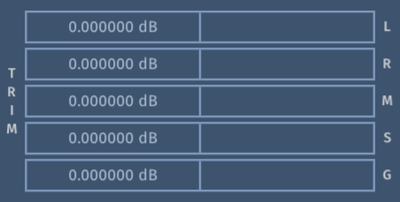
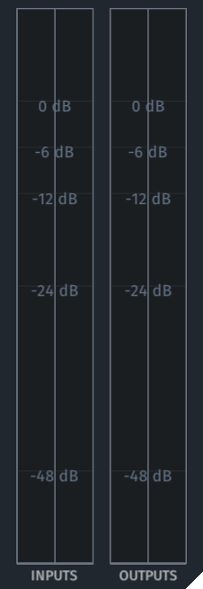

# RCEveryGain

## Watch The Accompanied Youtube Video

## Introduction

This audio plugin offers multiple methods of gain control for stereo tracks. Designed for both fine-tuning and broad adjustments.
The plugin features five sections: Shift, Fader, Gain, Trim, and Meter.

## Disclaimer

This plugin is delivered as is, with no guarantees for future updates or support.
Since it has only been briefly tested, use it at your own risk, and be sure to test it in your workflow before relying on it for critical projects.
Feedback is welcomed, but there are no promises for feature requests or changes.

## Installation

This plugin is portable and requires no installation. To set it up, simply drag the files to their corresponding plugin directories:

- **CLAP**: Place the `RCEveryGain.clap` in the CLAP plugin folder (e.g., `C:\Program Files\Common Files\CLAP` on Windows or `~/Library/Audio/Plug-Ins/CLAP` on macOS).
- **VST3**: Place the `RCEveryGain.vst3` in the VST3 folder (e.g., `C:\Program Files\Common Files\VST3` on Windows or `~/Library/Audio/Plug-Ins/VST3` on macOS).

After copying the files, restart or refresh your DAW to ensure it recognizes the new plugin formats.

## Shift Section

The Shift section allows you to adjust the gain using "bits," which are predefined factor of multiplication or division.
By default, a single bit shift either doubles or halves the gain, equivalent to roughly ±6 dB.
Changing the Size setting modifies the impact of each shift, allowing for more gradual or larger gain adjustments.

- **MAJOR**: Adjusts gain in whole bit steps, ranging from -8 to 8. Positive values increase gain, while negative values decrease it.

- **MINOR**: Provides fine-tuning within a single bit shift, ranging from -100% to 100% for precise adjustments between whole steps.

- **SIZE**: Determines the size of each bit, the factor by which each bit shift changes the gain. For example, a size of 0.5 makes each Major shift half as impactful, requiring two Major shifts to achieve the original gain change of one Major shift at a Size of 1.0.

These controls are ideal for driving saturation plugins; placing a +1 before and a -1 after increases input drive without altering the final output gain.

## Fader Section

The Fader section allows you to adjust the gain using percentage-based controls.

- **VOLUME**: This is the primary control for setting the overall gain. At 0%, the signal is fully attenuated, while 100% maintains the original level after the gain modifications by other sections.

- **CURVE**: Shapes the response of the Volume control. A lower curve value makes the slider focus more on the top, while a higher value makes it focus.

- **SMOOTHING**: Controls the rate at which volume changes occur. This setting adjusts the speed or time window over which the volume transitions take place, ensuring smooth adjustments without abrupt jumps in loudness.

This section is often used for constant riding and fade-ins/fade-outs mid or post effects.

## Gain and Trim Sections

The Gain and Trim sections offer traditional volume control using decibel (dB) units for precise amplitude adjustment. While both sections adjust gain, they differ in their adjustment ranges.

- **GAIN**: Allows for significant volume changes ranging from -24 dB to +24 dB.
- **TRIM**: Provides subtle adjustments within a narrower range of -6 dB to +6 dB.

Both sections feature five sliders to manipulate specific components of the stereo signal:

- **L** (Left): Adjusts the gain of the left channel.
- **R** (Right): Adjusts the gain of the right channel.
- **M** (Mid): Adjusts the mid (center) signal of a stereo mix.
- **S** (Side): Adjusts the side signals in a stereo mix.
- **G** (Gain): The master gain, adjusting the volume of both channels.

## Meter Section

The Meter section provides real-time visual feedback for monitoring audio levels. It displays both RMS (Root Mean Square) and max peak values for the input and output stereo channels, shown side by side for easy comparison. This section does not contain any user controls; it is purely for level monitoring.
